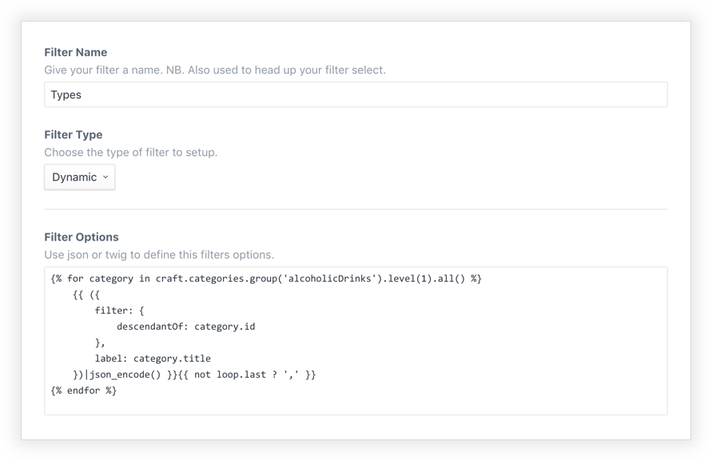
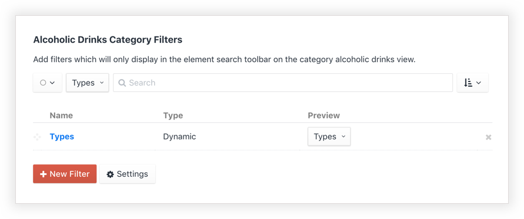
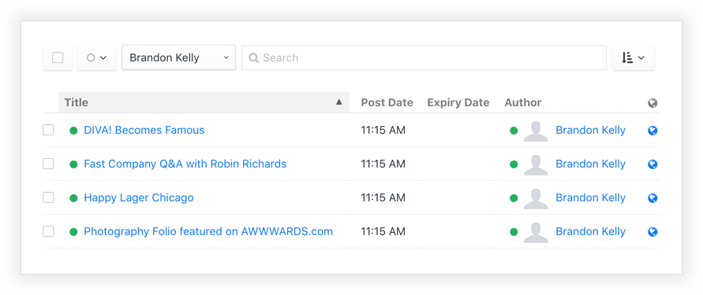
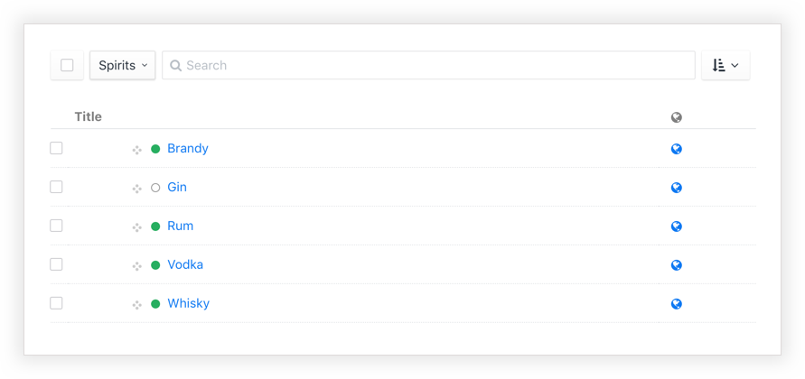
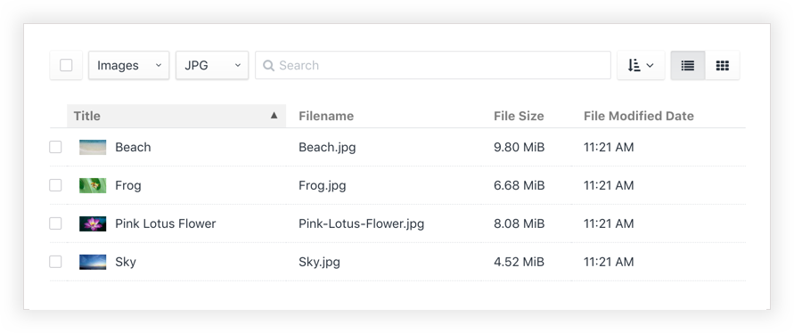

<p align="left"><a href="https://github.com/fruitstudios/craft-searchit" target="_blank"></a></p>

# Searchit plugin for Craft CMS 3

Configure powerful custom filters for an enhanced search experience in the Craft CMS control panel. Harness the power of twig and element queries to create endless filtering options. Keep your clients happy!

See it in action...

<p align="left"><a href="https://www.youtube.com/watch?v=CYzaND0IGPw" target="_blank"></a></p>

## Creating a filter

Filters can be produced manually or dynamically and are made up of a JSON array containing rows with a label key `(string)` and a filter key `(string or valid JSON)`. If the filter contains a `string` then it will pass that value to the `search` parameter on the element search. If you pass JSON to the filter than you can create multiple query parameters.

**Creating a filter**
<p align="left"></a></p>

**Ordering and preview**
<p align="left"></a></p>

You have two ways to setup filters. Manually or dynamically.

#### Using Twig (Recommended)

You can use the power of twig templating to create your filters. For example, if you want a filter entries by authors, then you can use the following...
```php

    {{ ({
        filter: {
            authorId: user.id
        },
        label: user.fullName
    })|json_encode() }}{{ not loop.last ? ',' }}

```

This essentially creates an element query like so...

```
{{ craft.entries.authorId(user.id).all() }}
```

#### Using JSON

Create a valid JSON array to build a filter

```json
{ "filter":"page 1", "label":"Page 1" },
{ "filter":"page 2", "label":"Page 2" },
{ "filter":"page 3", "label":"Page 3" },
{ "filter":"page 4", "label":"Page 4" }
```

As the filter value is passing a string, this is essentially creating an element query like so...
```
{{ craft.entries.search('page 1').all() }}
```

#### As an include
If you prefer to keep your code in your templates/repo, then you can link directly to templates.
```

```

## Example usage
Here are a few examples of different filters for different elements. The possibilities are endless!

### Entries

Create filters for authors, date, categories, etc..

*Example:  Filter by author...*
<p align="left"></a></p>

*How to get this filter...*

```

    {{ ({
        filter: {
            authorId: user.id
        },
        label: user.fullName
    })|json_encode() }}{{ not loop.last ? ',' }}

```

### Categories

Create filters to narrow down categories by heirarchy.

*Example:  Filter by top level category...*
<p align="left"></a></p>

*How to get this filter...*

```

   {{ ({
       filter: {
           descendantOf: category.id
       },
       label: category.title
   })|json_encode() }}{{ not loop.last ? ‘,’ }}

```

### Assets
Create filters for file types, extensions etc.

*Example:  Filter file type and extensions...*
<p align="left"></a></p>

*How to get these filters...*

**Kind filter**
```json
{ "filter":"kind:compressed", "label":"Zip" },
{ "filter":"kind:image", "label":"Images" }
```
**Extension filter**
```json
{ "filter":"extension:jpg", "label":"JPG" },
{ "filter":"extension:png", "label":"PNG" },
{ "filter":"extension:gif", "label":"GIF" }
```

## Roadmap
Support for Commerce coming very soon

#### Useful Resources
Craft CMS Search Documentation [Docs](https://docs.craftcms.com/v3/searching.html)

As with the regular Craft Search, if you suspect that your search indexes don’t have the latest and greatest data, you can have Craft rebuild them with the Rebuild Search Indexes tool in Settings. [Docs](https://docs.craftcms.com/v3/searching.html#rebuilding-your-search-indexes)


Brought to you by [FRUIT](https://fruitstudios.co.uk)
